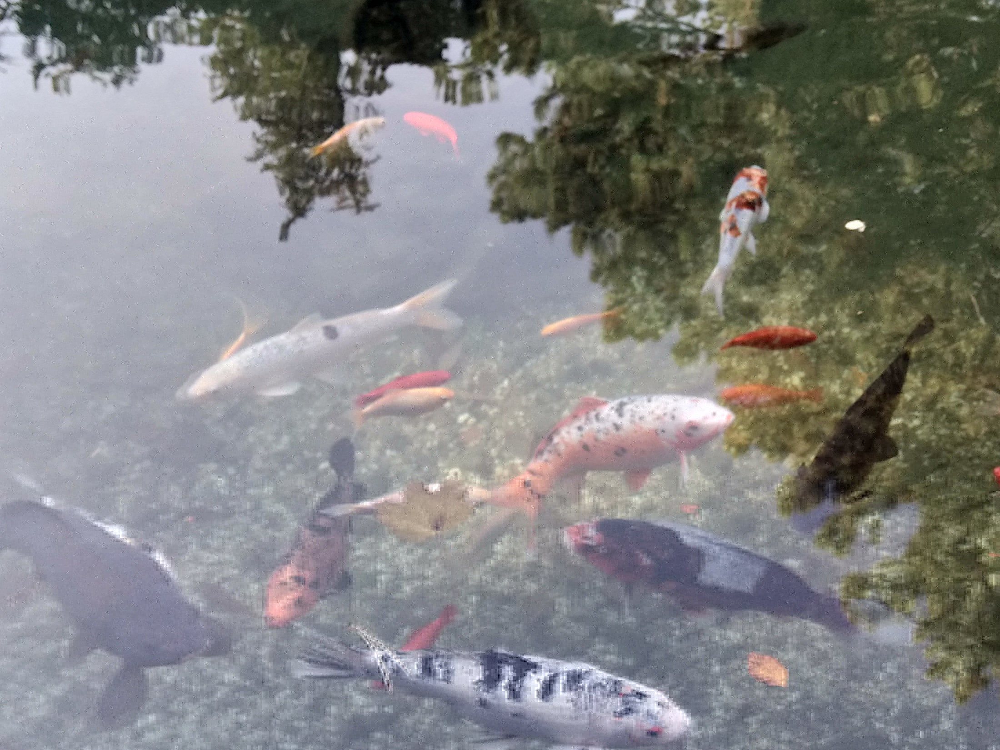

# visualARPoetry-backend

  
 This app print some random geometry onto the [fishes image](src/imgs/fishes.jpg), apply some glitch and save it to the disk. It's a **WIP** project of generative **ART** and **WebAR**. It serve as a "backend" for the [visualARPoetry](https://github.com/kalwalt/visualARPoetry) WebAR app.

## Project setup
```
npm install
```

### Compiles
```
npm run build
```

### Test
```
npm run test
```